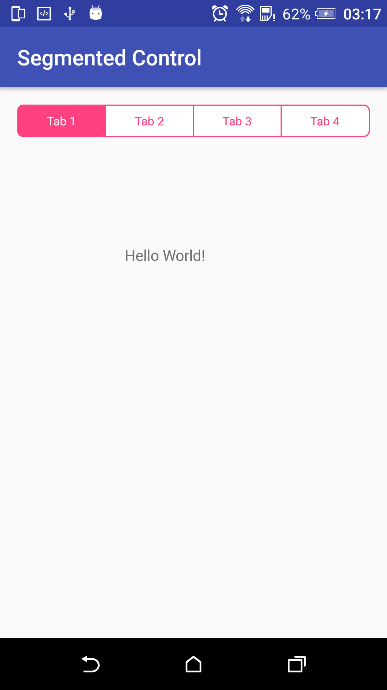

# Segmented-Horiontal-Control-Android
Segmented Horiontal Control Android

+1 star if you like :)



```java

ArrayList<String> arrItem = new ArrayList<>();
arrItem.add("Tab 1");
arrItem.add("Tab 2");
arrItem.add("Tab 3");
arrItem.add("Tab 4");

int strokeWidth = (int) getResources().getDimension(R.dimen._1sdp);
int cornerRadius = (int) getResources().getDimension(R.dimen._5sdp);
int colorStroke = getResources().getColor(R.color.colorAccent);
int colorSelected = getResources().getColor(R.color.colorAccent);
int colorNormal = getResources().getColor(R.color.white);
int textSize = (int) getResources().getDimension(R.dimen._11ssp);
int colorTextSelected = getResources().getColor(R.color.white);
int colorTextNormal = getResources().getColor(R.color.colorAccent);
int positionSelected = 0;

segmentedControl.setup(
	arrItem,
	strokeWidth,
	cornerRadius,
	colorStroke,
	colorSelected,
	colorNormal,
	textSize,
	colorTextSelected,
	colorTextNormal,
	positionSelected,
	new SegmentedHoriontalControl.OnItemSegmentedClickListener() {
	    @Override
	    public void onItemClick(View view, int position, String text) {
             	Log.d("thebv", "position = " + position + ", text = " + text);
    	    }
      	});
```
